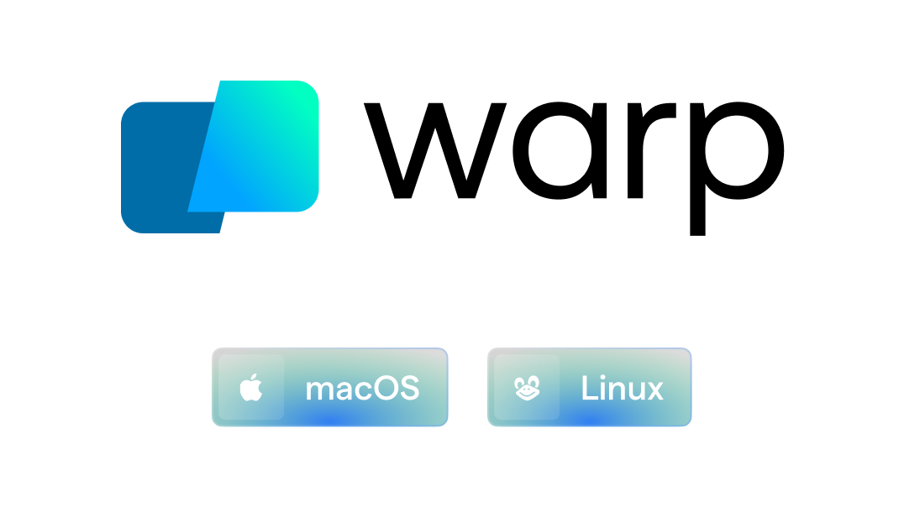

<p align="center">
  <br>
  <a href="https://github.com/sharkdp/bat/actions?query=workflow%3ACICD"></a>
  
  <a href="https://crates.io/crates/bat"></a><br>
  A <i>cat(1)</i> clone with syntax highlighting and Git integration.
</p>

<p align="center">
  <a href="#syntax-highlighting">Key Features</a> •
  <a href="#how-to-use">How To Use</a> •
  <a href="#installation">Installation</a> •
  <a href="#customization">Customization</a> •
  <a href="#project-goals-and-alternatives">Project goals, alternatives</a><br>
  [English]
  [<a href="doc/README-zh.md">中文</a>]
  [<a href="doc/README-ja.md">日本語</a>]
  [<a href="doc/README-ko.md">한국어</a>]
  [<a href="doc/README-ru.md">Русский</a>]
</p>

### Sponsors

A special *thank you* goes to our biggest <a href="doc/sponsors.md">sponsors</a>:<br>

<p>
<a href="https://www.warp.dev/bat">
  
  <br>
  <strong>Warp, the intelligent terminal</strong>
  <br>
  <sub>Available on MacOS, Linux, Windows</sub>
</a>
</p><p>
<a href="https://graphite.dev/?utm_source=github&utm_medium=repo&utm_campaign=bat">
  
  <br>
  <strong>Graphite is the AI developer productivity platform helping<br>teams on GitHub ship higher quality software, faster</strong>
</a>
</p>

### Syntax highlighting

`bat` supports syntax highlighting for a large number of programming and markup
languages:


### Git integration

`bat` communicates with `git` to show modifications with respect to the index
(see left side bar):


### Show non-printable characters

You can use the `-A`/`--show-all` option to show and highlight non-printable
characters:


### Automatic paging

By default, `bat` pipes its own output to a pager (e.g. `less`) if the output is too large for one screen.
If you would rather `bat` work like `cat` all the time (never page output), you can set `--paging=never` as an option, either on the command line or in your configuration file.
If you intend to alias `cat` to `bat` in your shell configuration, you can use `alias cat='bat --paging=never'` to preserve the default behavior.

#### File concatenation

Even with a pager set, you can still use `bat` to concatenate files :wink:.
Whenever `bat` detects a non-interactive terminal (i.e. when you pipe into another process or into a file), `bat` will act as a drop-in replacement for `cat` and fall back to printing the plain file contents, regardless of the `--pager` option's value.

## How to use

Display a single file on the terminal

```bash
> bat README.md
```

Display multiple files at once

```bash
> bat src/*.rs
```

Read from stdin, determine the syntax automatically (note, highlighting will
only work if the syntax can be determined from the first line of the file,
usually through a shebang such as `#!/bin/sh`)

```bash
> curl -s https://sh.rustup.rs | bat
```

Read from stdin, specify the language explicitly

```bash
> yaml2json .travis.yml | json_pp | bat -l json
```

Show and highlight non-printable characters:
```bash
> bat -A /etc/hosts
```

Use it as a `cat` replacement:

```bash
bat > note.md  # quickly create a new file

bat header.md content.md footer.md > document.md

bat -n main.rs  # show line numbers (only)

bat f - g  # output 'f', then stdin, then 'g'.
```

### Integration with other tools

#### `fzf`

You can use `bat` as a previewer for [`fzf`](https://github.com/junegunn/fzf). To do this,
use `bat`'s `--color=always` option to force colorized output. You can also use `--line-range`
option to restrict the load times for long files:

```bash
fzf --preview "bat --color=always --style=numbers --line-range=:500 {}"
```

For more information, see [`fzf`'s `README`](https://github.com/junegunn/fzf#preview-window).

#### `find` or `fd`

You can use the `-exec` option of `find` to preview all search results with `bat`:

```bash
find … -exec bat {} +
```

If you happen to use [`fd`](https://github.com/sharkdp/fd), you can use the `-X`/`--exec-batch` option to do the same:

```bash
fd … -X bat
```

#### `ripgrep`

With [`batgrep`](https://github.com/eth-p/bat-extras/blob/master/doc/batgrep.md), `bat` can be used as the printer for [`ripgrep`](https://github.com/BurntSushi/ripgrep) search results.

```bash
batgrep needle src/
```

#### `tail -f`

`bat` can be combined with `tail -f` to continuously monitor a given file with syntax highlighting.

```bash
tail -f /var/log/pacman.log | bat --paging=never -l log
```

Note that we have to switch off paging in order for this to work. We have also specified the syntax
explicitly (`-l log`), as it can not be auto-detected in this case.

#### `git`

You can combine `bat` with `git show` to view an older version of a given file with proper syntax
highlighting:

```bash
git show v0.6.0:src/main.rs | bat -l rs
```

#### `git diff`

You can combine `bat` with `git diff` to view lines around code changes with proper syntax
highlighting:
```bash
batdiff() {
    git diff --name-only --relative --diff-filter=d -z | xargs -0 bat --diff
}
```
If you prefer to use this as a separate tool, check out `batdiff` in [`bat-extras`](https://github.com/eth-p/bat-extras).

If you are looking for more support for git and diff operations, check out [`delta`](https://github.com/dandavison/delta).

#### `xclip`

The line numbers and Git modification markers in the output of `bat` can make it hard to copy
the contents of a file. To prevent this, you can call `bat` with the `-p`/`--plain` option or
simply pipe the output into `xclip`:
```bash
bat main.cpp | xclip
```
`bat` will detect that the output is being redirected and print the plain file contents.

#### `man`

`bat` can be used as a colorizing pager for `man`, by setting the
`MANPAGER` environment variable:

```bash
export MANPAGER="sh -c 'awk '\''{ gsub(/\x1B\[[0-9;]*m/, \"\", \$0); gsub(/.\x08/, \"\", \$0); print }'\'' | bat -p -lman'"
man 2 select
```
(replace `bat` with `batcat` if you are on Debian or Ubuntu)

If you prefer to have this bundled in a new command, you can also use [`batman`](https://github.com/eth-p/bat-extras/blob/master/doc/batman.md).

> [!WARNING]  
> This will [not work](https://github.com/sharkdp/bat/issues/1145) out of the box with Mandoc's `man` implementation.
>
> Please either use `batman`, or convert the shell script to a [shebang executable](https://en.wikipedia.org/wiki/Shebang_(Unix)) and point `MANPAGER` to that.

Note that the [Manpage syntax](assets/syntaxes/02_Extra/Manpage.sublime-syntax) is developed in this repository and still needs some work.

#### `prettier` / `shfmt` / `rustfmt`

The [`prettybat`](https://github.com/eth-p/bat-extras/blob/master/doc/prettybat.md) script is a wrapper that will format code and print it with `bat`.

#### `Warp`

<a href="https://app.warp.dev/drive/folder/-Bat-Warp-Pack-lxhe7HrEwgwpG17mvrFSz1">
  
</a>

#### Highlighting `--help` messages

You can use `bat` to colorize help text: `$ cp --help | bat -plhelp`

You can also use a wrapper around this:

```bash
# in your .bashrc/.zshrc/*rc
alias bathelp='bat --plain --language=help'
help() {
    "$@" --help 2>&1 | bathelp
}
```

Then you can do `$ help cp` or `$ help git commit`.

When you are using `zsh`, you can also use global aliases to override `-h` and `--help` entirely:

```bash
alias -g -- -h='-h 2>&1 | bat --language=help --style=plain'
alias -g -- --help='--help 2>&1 | bat --language=help --style=plain'
```

For `fish`, you can use abbreviations:

```fish
abbr -a --position anywhere -- --help '--help | bat -plhelp'
abbr -a --position anywhere -- -h '-h | bat -plhelp'
```

This way, you can keep on using `cp --help`, but get colorized help pages.

Be aware that in some cases, `-h` may not be a shorthand of `--help` (for example with `ls`). In cases where you need to use `-h` 
as a command argument you can prepend `\` to the arguement (eg. `ls \-h`) to escape the aliasing defined above. 

Please report any issues with the help syntax in [this repository](https://github.com/victor-gp/cmd-help-sublime-syntax).


## Installation

<!--

Installation instructions need to:
* be for widely used systems
* be non-obvious
* be from somewhat official sources

-->

[](https://repology.org/project/bat-cat/versions)

### On Ubuntu (using `apt`)
*... and other Debian-based Linux distributions.*

`bat` is available on [Ubuntu since 20.04 ("Focal")](https://packages.ubuntu.com/search?keywords=bat&exact=1) and [Debian since August 2021 (Debian 11 - "Bullseye")](https://packages.debian.org/bullseye/bat).

If your Ubuntu/Debian installation is new enough you can simply run:

```bash
sudo apt install bat
```

**Important**: If you install `bat` this way, please note that the executable may be installed as `batcat` instead of `bat` (due to [a name
clash with another package](https://github.com/sharkdp/bat/issues/982)). You can set up a `bat -> batcat` symlink or alias to prevent any issues that may come up because of this and to be consistent with other distributions:
``` bash
mkdir -p ~/.local/bin
ln -s /usr/bin/batcat ~/.local/bin/bat
```

an example alias for `batcat` as `bat`:
```bash
alias bat="batcat"
```

### On Ubuntu (using most recent `.deb` packages)
*... and other Debian-based Linux distributions.*

If the package has not yet been promoted to your Ubuntu/Debian installation, or you want
the most recent release of `bat`, download the latest `.deb` package from the
[release page](https://github.com/sharkdp/bat/releases) and install it via:

```bash
sudo dpkg -i bat_0.18.3_amd64.deb  # adapt version number and architecture
```

### On Alpine Linux

You can install [the `bat` package](https://pkgs.alpinelinux.org/packages?name=bat)
from the official sources, provided you have the appropriate repository enabled:

```bash
apk add bat
```

### On Arch Linux

You can install [the `bat` package](https://www.archlinux.org/packages/extra/x86_64/bat/)
from the official sources:

```bash
pacman -S bat
```

### On Fedora

You can install [the `bat` package](https://koji.fedoraproject.org/koji/packageinfo?packageID=27506) from the official [Fedora Modular](https://docs.fedoraproject.org/en-US/modularity/using-modules/) repository.

```bash
dnf install bat
```

### On Gentoo Linux

You can install [the `bat` package](https://packages.gentoo.org/packages/sys-apps/bat)
from the official sources:

```bash
emerge sys-apps/bat
```

### On FreeBSD

You can install a precompiled [`bat` package](https://www.freshports.org/textproc/bat) with pkg:

```bash
pkg install bat
```

or build it on your own from the FreeBSD ports:

```bash
cd /usr/ports/textproc/bat
make install
```

### On OpenBSD

You can install `bat` package using [`pkg_add(1)`](https://man.openbsd.org/pkg_add.1):

```bash
pkg_add bat
```

### Via nix

You can install `bat` using the [nix package manager](https://nixos.org/nix):

```bash
nix-env -i bat
```

### On openSUSE

You can install `bat` with zypper:

```bash
zypper install bat
```

### Via snap package

There is currently no recommended snap package available.
Existing packages may be available, but are not officially supported and may contain [issues](https://github.com/sharkdp/bat/issues/1519).

### On macOS (or Linux) via Homebrew

You can install `bat` with [Homebrew](https://formulae.brew.sh/formula/bat):

```bash
brew install bat
```

### On macOS via MacPorts

Or install `bat` with [MacPorts](https://ports.macports.org/port/bat/summary):

```bash
port install bat
```

### On Windows

There are a few options to install `bat` on Windows. Once you have installed `bat`,
take a look at the ["Using `bat` on Windows"](#using-bat-on-windows) section.

#### Prerequisites

You will need to install the [Visual C++ Redistributable](https://learn.microsoft.com/en-us/cpp/windows/latest-supported-vc-redist#latest-microsoft-visual-c-redistributable-version)

#### With WinGet

You can install `bat` via [WinGet](https://learn.microsoft.com/en-us/windows/package-manager/winget):

```bash
winget install sharkdp.bat
```

#### With Chocolatey

You can install `bat` via [Chocolatey](https://chocolatey.org/packages/Bat):
```bash
choco install bat
```

#### With Scoop

You can install `bat` via [scoop](https://scoop.sh/):
```bash
scoop install bat
```

#### From prebuilt binaries:

You can download prebuilt binaries from the [Release page](https://github.com/sharkdp/bat/releases),

You will need to install the [Visual C++ Redistributable](https://support.microsoft.com/en-us/help/2977003/the-latest-supported-visual-c-downloads) package.

### From binaries

Check out the [Release page](https://github.com/sharkdp/bat/releases) for
prebuilt versions of `bat` for many different architectures. Statically-linked
binaries are also available: look for archives with `musl` in the file name.

### From source

If you want to build `bat` from source, you need Rust 1.74.0 or
higher. You can then use `cargo` to build everything:

#### From local source
```bash
cargo install --path . --locked
```
> [!NOTE]
> The `--path .` above specifies the directory of the source code and NOT where `bat` will be installed.
> For more information see the docs for [`cargo install`](https://doc.rust-lang.org/cargo/commands/cargo-install.html).

#### From `crates.io`
```bash
cargo install --locked bat
```

Note that additional files like the man page or shell completion
files can not be installed automatically in both these ways.
If installing from a local source, they will be generated by `cargo`
and should be available in the cargo target folder under `build`.

Furthermore, shell completions are also available by running:
```bash
bat --completion <shell>
# see --help for supported shells
```

## Customization

### Highlighting theme

Use `bat --list-themes` to get a list of all available themes for syntax
highlighting. By default, `bat` uses `Monokai Extended` or `Monokai Extended Light`
for dark and light themes respectively. To select the `TwoDark` theme, call `bat`
with the `--theme=TwoDark` option or set the `BAT_THEME` environment variable to
`TwoDark`. Use `export BAT_THEME="TwoDark"` in your shell's startup file to
make the change permanent. Alternatively, use `bat`'s
[configuration file](#configuration-file).

If you want to preview the different themes on a custom file, you can use
the following command (you need [`fzf`](https://github.com/junegunn/fzf) for this):
```bash
bat --list-themes | fzf --preview="bat --theme={} --color=always /path/to/file"
```

`bat` automatically picks a fitting theme depending on your terminal's background color.
You can use the `--theme-dark` / `--theme-light` options or the `BAT_THEME_DARK` / `BAT_THEME_LIGHT` environment variables
to customize the themes used. This is especially useful if you frequently switch between dark and light mode.

You can also use a custom theme by following the
['Adding new themes' section below](#adding-new-themes).

### 8-bit themes

`bat` has three themes that always use [8-bit colors](https://en.wikipedia.org/wiki/ANSI_escape_code#Colors),
even when truecolor support is available:

- `ansi` looks decent on any terminal. It uses 3-bit colors: black, red, green,
  yellow, blue, magenta, cyan, and white.
- `base16` is designed for [base16](https://github.com/tinted-theming/home) terminal themes. It uses
  4-bit colors (3-bit colors plus bright variants) in accordance with the
  [base16 styling guidelines](https://github.com/tinted-theming/home/blob/main/styling.md).
- `base16-256` is designed for [tinted-shell](https://github.com/tinted-theming/tinted-shell).
  It replaces certain bright colors with 8-bit colors from 16 to 21. **Do not** use this simply
  because you have a 256-color terminal but are not using tinted-shell.

Although these themes are more restricted, they have three advantages over truecolor themes. They:

- Enjoy maximum compatibility. Some terminal utilities do not support more than 3-bit colors.
- Adapt to terminal theme changes. Even for already printed output.
- Visually harmonize better with other terminal software.

### Output style

You can use the `--style` option to control the appearance of `bat`'s output.
You can use `--style=numbers,changes`, for example, to show only Git changes
and line numbers but no grid and no file header. Set the `BAT_STYLE` environment
variable to make these changes permanent or use `bat`'s
[configuration file](#configuration-file).

>[!tip]
> If you specify a default style in `bat`'s config file, you can change which components
> are displayed during a single run of `bat` using the `--style` command-line argument.
> By prefixing a component with `+` or `-`, it can be added or removed from the current style.
>
> For example, if your config contains `--style=full,-snip`, you can run bat with
> `--style=-grid,+snip` to remove the grid and add back the `snip` component.
> Or, if you want to override the styles completely, you use `--style=numbers` to
> only show the line numbers.

### Adding new syntaxes / language definitions

Should you find that a particular syntax is not available within `bat`, you can follow these
instructions to easily add new syntaxes to your current `bat` installation.

`bat` uses the excellent [`syntect`](https://github.com/trishume/syntect/)
library for syntax highlighting. `syntect` can read any
[Sublime Text `.sublime-syntax` file](https://www.sublimetext.com/docs/3/syntax.html)
and theme.

A good resource for finding Sublime Syntax packages is [Package Control](https://packagecontrol.io/). Once you found a
syntax:

1. Create a folder with syntax definition files:

   ```bash
   mkdir -p "$(bat --config-dir)/syntaxes"
   cd "$(bat --config-dir)/syntaxes"

   # Put new '.sublime-syntax' language definition files
   # in this folder (or its subdirectories), for example:
   git clone https://github.com/tellnobody1/sublime-purescript-syntax
   ```

2. Now use the following command to parse these files into a binary cache:

   ```bash
   bat cache --build
   ```

3. Finally, use `bat --list-languages` to check if the new languages are available.

   If you ever want to go back to the default settings, call:

   ```bash
   bat cache --clear
   ```

4. If you think that a specific syntax should be included in `bat` by default, please
   consider opening a "syntax request" ticket after reading the policies and
   instructions [here](doc/assets.md): [Open Syntax Request](https://github.com/sharkdp/bat/issues/new?labels=syntax-request&template=syntax_request.md).

### Adding new themes

This works very similar to how we add new syntax definitions.
> [!NOTE]
> Themes are stored in [`.tmTheme` files](https://www.sublimetext.com/docs/color_schemes_tmtheme.html).

First, create a folder with the new syntax highlighting themes:
```bash
mkdir -p "$(bat --config-dir)/themes"
cd "$(bat --config-dir)/themes"

# Download a theme in '.tmTheme' format, for example:
git clone https://github.com/greggb/sublime-snazzy

# Update the binary cache
bat cache --build
```

Finally, use `bat --list-themes` to check if the new themes are available.
> [!NOTE]
> `bat` uses the name of the `.tmTheme` file for the theme's name. 

### Adding or changing file type associations

You can add new (or change existing) file name patterns using the `--map-syntax`
command line option. The option takes an argument of the form `pattern:syntax` where
`pattern` is a glob pattern that is matched against the file name and
the absolute file path. The `syntax` part is the full name of a supported language
(use `bat --list-languages` for an overview).

**Note:** You probably want to use this option as [an entry in `bat`'s configuration file](#configuration-file)
for persistence instead of passing it on the command line as a one-off. Generally
you'd just use `-l` if you want to manually specify a language for a file.

Example: To use "INI" syntax highlighting for all files with a `.conf` file extension, use
```bash
--map-syntax='*.conf:INI'
```

Example: To open all files called `.ignore` (exact match) with the "Git Ignore" syntax, use:
```bash
--map-syntax='.ignore:Git Ignore'
```

Example: To open all `.conf` files in subfolders of `/etc/apache2` with the "Apache Conf"
syntax, use (this mapping is already built in):
```bash
--map-syntax='/etc/apache2/**/*.conf:Apache Conf'
```

### Using a different pager

`bat` uses the pager that is specified in the `PAGER` environment variable. If this variable is not
set, `less` is used by default. If you want to use a different pager, you can either modify the
`PAGER` variable or set the `BAT_PAGER` environment variable to override what is specified in
`PAGER`.

>[!NOTE]
> If `PAGER` is `more` or `most`, `bat` will silently use `less` instead to ensure support for colors.

If you want to pass command-line arguments to the pager, you can also set them via the
`PAGER`/`BAT_PAGER` variables:

```bash
export BAT_PAGER="less -RF"
```

Instead of using environment variables, you can also use `bat`'s [configuration file](#configuration-file) to configure the pager (`--pager` option).


### Using `less` as a pager

When using `less` as a pager, `bat` will automatically pass extra options along to `less`
to improve the experience. Specifically, `-R`/`--RAW-CONTROL-CHARS`, `-F`/`--quit-if-one-screen`,
and under certain conditions, `-X`/`--no-init` and/or `-S`/`--chop-long-lines`.

>[!IMPORTANT]
> These options will not be added if:
> - The pager is not named `less`.
> - The `--pager` argument contains any command-line arguments (e.g. `--pager="less -R"`).
> - The `BAT_PAGER` environment variable contains any command-line arguments (e.g. `export BAT_PAGER="less -R"`)
>
> The `--quit-if-one-screen` option will not be added when:
> - The `--paging=always` argument is used.
> - The `BAT_PAGING` environment is set to `always`.

The `-R` option is needed to interpret ANSI colors correctly.

The `-F` option instructs `less` to exit immediately if the output size is smaller than
the vertical size of the terminal. This is convenient for small files because you do not
have to press `q` to quit the pager.

The `-X` option is needed to fix a bug with the `--quit-if-one-screen` feature in versions
of `less` older than version 530. Unfortunately, it also breaks mouse-wheel support in `less`.
If you want to enable mouse-wheel scrolling on older versions of `less` and do not mind losing
the quit-if-one-screen feature, you can set the pager (via `--pager` or `BAT_PAGER`) to `less -R`.
For `less` 530 or newer, it should work out of the box.

The `-S` option is added when `bat`'s `-S`/`--chop-long-lines` option is used. This tells `less`
to truncate any lines larger than the terminal width.

### Indentation

`bat` expands tabs to 4 spaces by itself, not relying on the pager. To change this, simply add the
`--tabs` argument with the number of spaces you want to be displayed.

**Note**: Defining tab stops for the pager (via the `--pager` argument by `bat`, or via the `LESS`
environment variable for `less`) won't be taken into account because the pager will already get
expanded spaces instead of tabs. This behaviour is added to avoid indentation issues caused by the
sidebar. Calling `bat` with `--tabs=0` will override it and let tabs be consumed by the pager.

### Dark mode

If you make use of the dark mode feature in **macOS**, you might want to configure `bat` to use a different
theme based on the OS theme. The following snippet uses the `default` theme when in the _dark mode_
and the `GitHub` theme when in the _light mode_.

```bash
alias cat="bat --theme auto:system --theme-dark default --theme-light GitHub"
```

The same dark mode feature is now available in **GNOME** and affects the `org.gnome.desktop.interface color-scheme` setting. The following code converts the above to use said setting.

```bash
# .bashrc
sys_color_scheme_is_dark() {
    condition=$(gsettings get org.gnome.desktop.interface color-scheme)
    condition=$(echo "$condition" | tr -d "[:space:]'")
    if [ $condition == "prefer-dark" ]; then
        return 0
    else
        return 1
    fi
}

bat_alias_wrapper() {
    #get color scheme
    sys_color_scheme_is_dark
    if [[ $? -eq 0 ]]; then
        # bat command with dark color scheme
        bat --theme=default "$@"
    else
        # bat command with light color scheme
        bat --theme=GitHub "$@"
    fi
}
alias cat='bat_alias_wrapper'
```


## Configuration file

`bat` can also be customized with a configuration file. The location of the file is dependent
on your operating system. To get the default path for your system, call
```bash
bat --config-file
```

Alternatively, you can use `BAT_CONFIG_PATH` or `BAT_CONFIG_DIR` environment variables to point `bat`
to a non-default location of the configuration file or the configuration directory respectively:
```bash
export BAT_CONFIG_PATH="/path/to/bat/bat.conf"
export BAT_CONFIG_DIR="/path/to/bat"
```

A default configuration file can be created with the `--generate-config-file` option.
```bash
bat --generate-config-file
```

There is also now a systemwide configuration file, which is located under `/etc/bat/config` on
Linux and Mac OS and `C:\ProgramData\bat\config` on windows. If the system wide configuration
file is present, the content of the user configuration will simply be appended to it.

### Format

The configuration file is a simple list of command line arguments. Use `bat --help` to see a full list of possible options and values. In addition, you can add comments by prepending a line with the `#` character.

Example configuration file:
```bash
# Set the theme to "TwoDark"
--theme="TwoDark"

# Show line numbers, Git modifications and file header (but no grid)
--style="numbers,changes,header"

# Use italic text on the terminal (not supported on all terminals)
--italic-text=always

# Use C++ syntax for Arduino .ino files
--map-syntax "*.ino:C++"
```

## Using `bat` on Windows

`bat` mostly works out-of-the-box on Windows, but a few features may need extra configuration.

### Prerequisites

You will need to install the [Visual C++ Redistributable](https://support.microsoft.com/en-us/help/2977003/the-latest-supported-visual-c-downloads) package.

### Paging

Windows only includes a very limited pager in the form of `more`. You can download a Windows binary
for `less` [from its homepage](http://www.greenwoodsoftware.com/less/download.html) or [through
Chocolatey](https://chocolatey.org/packages/Less). To use it, place the binary in a directory in
your `PATH` or [define an environment variable](#using-a-different-pager). The [Chocolatey package](#on-windows) installs `less` automatically.

### Colors

Windows 10 natively supports colors in both `conhost.exe` (Command Prompt) and PowerShell since
[v1511](https://en.wikipedia.org/wiki/Windows_10_version_history#Version_1511_(November_Update)), as
well as in newer versions of bash. On earlier versions of Windows, you can use
[Cmder](http://cmder.app/), which includes [ConEmu](https://conemu.github.io/).

**Note:** Old versions of `less` do not correctly interpret colors on Windows. To fix this, you can add the optional Unix tools to your PATH when installing Git. If you don’t have any other pagers installed, you can disable paging entirely by passing `--paging=never` or by setting `BAT_PAGER` to an empty string.

### Cygwin

`bat` on Windows does not natively support Cygwin's unix-style paths (`/cygdrive/*`). When passed an absolute cygwin path as an argument, `bat` will encounter the following error: `The system cannot find the path specified. (os error 3)`

This can be solved by creating a wrapper or adding the following function to your `.bash_profile` file:

```bash
bat() {
    local index
    local args=("$@")
    for index in $(seq 0 ${#args[@]}) ; do
        case "${args[index]}" in
        -*) continue;;
        *)  [ -e "${args[index]}" ] && args[index]="$(cygpath --windows "${args[index]}")";;
        esac
    done
    command bat "${args[@]}"
}
```

## Troubleshooting

### Garbled output

If an input file contains color codes or other ANSI escape sequences or control characters, `bat` will have problems
performing syntax highlighting and text wrapping, and thus the output can become garbled.

If your version of `bat` supports the `--strip-ansi=auto` option, it can be used to remove such sequences
before syntax highlighting. Alternatively, you may disable both syntax highlighting and wrapping by
passing the `--color=never --wrap=never` options to `bat`.

> [!NOTE]
> The `auto` option of `--strip-ansi` avoids removing escape sequences when the syntax is plain text.

### Terminals & colors

`bat` handles terminals *with* and *without* truecolor support. However, the colors in most syntax
highlighting themes are not optimized for 8-bit colors. It is therefore strongly recommended
that you use a terminal with 24-bit truecolor support (`terminator`, `konsole`, `iTerm2`, ...),
or use one of the basic [8-bit themes](#8-bit-themes) designed for a restricted set of colors.
See [this article](https://gist.github.com/XVilka/8346728) for more details and a full list of
terminals with truecolor support.

Make sure that your truecolor terminal sets the `COLORTERM` variable to either `truecolor` or
`24bit`. Otherwise, `bat` will not be able to determine whether or not 24-bit escape sequences
are supported (and fall back to 8-bit colors).

### Line numbers and grid are hardly visible

Please try a different theme (see `bat --list-themes` for a list). The `OneHalfDark` and
`OneHalfLight` themes provide grid and line colors that are brighter.

### File encodings

`bat` natively supports UTF-8 as well as UTF-16. For every other file encoding, you may need to
convert to UTF-8 first because the encodings can typically not be auto-detected. You can `iconv`
to do so.
Example: if you have a PHP file in Latin-1 (ISO-8859-1) encoding, you can call:
``` bash
iconv -f ISO-8859-1 -t UTF-8 my-file.php | bat
```
Note: you might have to use the `-l`/`--language` option if the syntax can not be auto-detected
by `bat`.

## Development

```bash
# Recursive clone to retrieve all submodules
git clone --recursive https://github.com/sharkdp/bat

# Build (debug version)
cd bat
cargo build --bins

# Run unit tests and integration tests
cargo test

# Install (release version)
cargo install --path . --locked

# Build a bat binary with modified syntaxes and themes
bash assets/create.sh
cargo install --path . --locked --force
```

If you want to build an application that uses `bat`'s pretty-printing
features as a library, check out the [the API documentation](https://docs.rs/bat/).
Note that you have to use either `regex-onig` or `regex-fancy` as a feature
when you depend on `bat` as a library.

## Contributing

Take a look at the [`CONTRIBUTING.md`](CONTRIBUTING.md) guide.

## Maintainers

- [sharkdp](https://github.com/sharkdp)
- [eth-p](https://github.com/eth-p)
- [keith-hall](https://github.com/keith-hall)
- [Enselic](https://github.com/Enselic)

## Security vulnerabilities

Please contact [David Peter](https://david-peter.de/) via email if you want to report a vulnerability in `bat`.

## Project goals and alternatives

`bat` tries to achieve the following goals:

- Provide beautiful, advanced syntax highlighting
- Integrate with Git to show file modifications
- Be a drop-in replacement for (POSIX) `cat`
- Offer a user-friendly command-line interface

There are a lot of alternatives, if you are looking for similar programs. See
[this document](doc/alternatives.md) for a comparison.

## License
Copyright (c) 2018-2023 [bat-developers](https://github.com/sharkdp/bat).

`bat` is made available under the terms of either the MIT License or the Apache License 2.0, at your option.

See the [LICENSE-APACHE](LICENSE-APACHE) and [LICENSE-MIT](LICENSE-MIT) files for license details.
