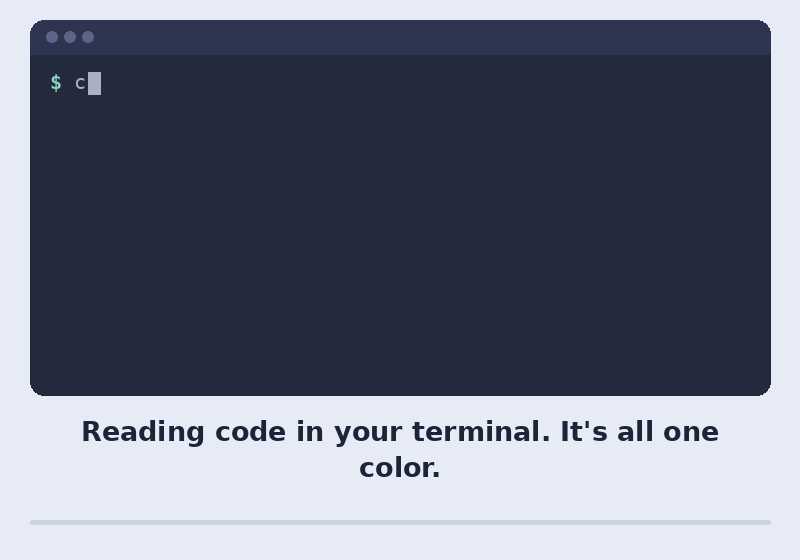

# Watch: bat in 15 seconds

bat is a cat clone with syntax highlighting and Git integration.
It shows your files with colors and line numbers, and marks the lines
you've changed.

*This video was generated with AI from the project's README.*
